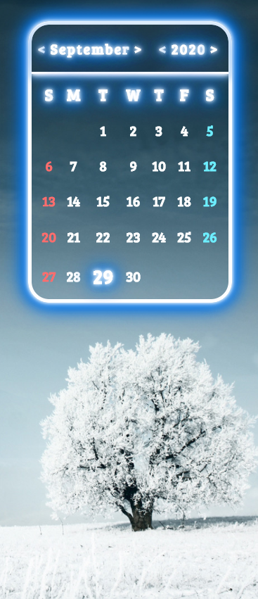

# Calendar

Hello and welcome to my <b>Calendar</b> project.

My Calendar project is build from scratch and written in vanilla JavaScript code. 
The project is hosted <a href="https://calendar-3295f.web.app/"><b>here</b></a>

I have included all files now, unlike in my <b>Calculator</b> project, so you can check entire code and workflow. 
Since my workflow is a little bit different the main files of this project are: 

<b>index.html</b>, 
<b>script.js</b> (concat, babel, terser),  
<b>style.css</b> (autoprefixer, cssnano)  

The 'calendar.js' and/if any other except 'script-concat.js' and 'script.js' are just script files in which I work like modules. (in this project, only this one). 
The 'script-concat.js' file is file which contains all script files concatenated together except himself and main one 'script.js'. 
The 'style-scss.css' file is a file where all my scss files are put together using 'gulp-sass'.

